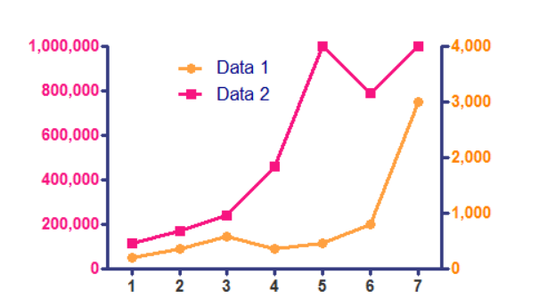

T.C. Çevre Şehircilik ve İklim Değişikliği bakanlığının ülke genelinde yaptığı hava kalitesi
ölçümleri [https://sim.csb.gov.tr/Services/AirQuality](https://sim.csb.gov.tr/Services/AirQuality) adresinde bulunan web uygulamasında istasyon bazında görsellenebilmektedir. 

Ham veriler ise [https://sim.csb.gov.tr/STN/STN_Report/StationDataDownloadNew](https://sim.csb.gov.tr/STN/STN_Report/StationDataDownloadNew) adresinden *Excel* formatında indirlebilmektedir. 

## Egzersiz 1 - Veri ithali

**Doğduğunuz şehre** ait olan **saatlik** hava kalitesi parametrelerini *Excel* formatında **doğduğunuz ay** için indirin. Tam bir aylık veri indirmeniz gerekmektedir.

Örnek :

- Mart ayında doğduysanız Mart 2023 verisi (Çünkü Mart 2024 bitmedi)
- Aralık ayında doğduysanız Aralık 2023 verisi
- Şubat ayında doğduysanız Şubat 2024 verisi

Yaratacağınız data.frame nesnesinin sütun isimleri Excel'de bulunan değişken sütun isimlerini içermelidir. *havaK* nesnesinin ilk 10 satırının raporda gözükmesini sağlayın.

```{r}
# Excel dosyasındaki ham verileri data.frame formatında R'a ithal edin
library(readxl)
havaK <- read_excel("C:/mert_is/Exercises/Week4/Mini-Project/veriler.xlsx",skip=1)
```

## Egzersiz 2 - Veri Kalite Kontrolü

### Zaman sütunu
Zaman değerlerini içeren sütunun isminin **Time** olmasını sağlayın
```{r}
colnames(havaK)[1] <- "Time"
```


*havaK$Time* adlı değişkendeki bütün verilerin **POSIXct** tipinde olmasını sağlayın. 

```{r}
havaK$Time <- as.POSIXct(havaK$Time, format = "%Y-%m-%d %H:%M:%S", tz = "UTC")
```

*Time* sütunu dışındaki bütün sütunların tipinin **numeric** olmasını sağlayın. *havaK* nesnesinin ilk 10 satırının raporda gözükmesini sağlayın.

```{r}
havaK[-which(names(havaK) == "Time")] <- lapply(havaK[-which(names(havaK) == "Time")], function(x) {
  # Sayısal olmayan karakterleri ve boşlukları temizle
  x <- gsub("[^0-9,]", "", x)
  # Ondalık ayırıcıları noktaya çevir
  
  #- olanları boş yapalım ki NA çevrilsin
  x <- gsub("-", "", x)
  x <- gsub(",", ".", x)
  # Sayısal değerlere dönüştür
  as.numeric(x)
})

head(havaK, 10)

```

## Egzersiz 3 - Veri Görselleme
*dygraphs* paketini kullanarak veri setinizde bulunan iki farklı parametreyi aynı grafik üzerinde iki değişik aks kullanarak (bkz örnek) çizin.




```{r}
library(dygraphs)
library(xts)
havaK_xts <- xts(havaK[, c(3, 4)], order.by=havaK$Time)
# Oluşturulan xts nesnesi için dygraph oluşturma
dygraph(havaK_xts) %>%
  #Sırası ile renkler
  dyOptions(colors = c("blue", "red")) %>%
  #Sol
  dyAxis("y", label = "PM 2.5 ( µg/m3 )") %>%
  #Sağ
  dyAxis("y2", label = "SO2 ( µg/m3 )", independentTicks = TRUE) %>%
  dySeries(names(havaK_xts)[2], axis = 'y2')
```
